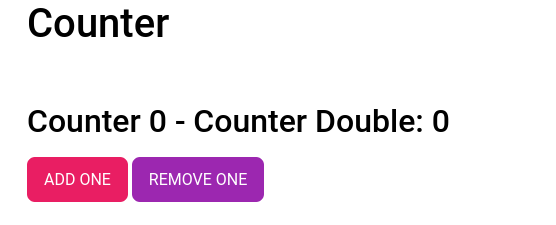

# Esercizio 1

Implementare un semplice contatore che visualizzi come risultato quanto segue:

- [ ] Implementare un componente React che rispetti quello nella figura sopra (non hanno importanza i font o i colori).
- [ ] Implementare un listener sul pulsante "ADD ONE" che incrementi il di 1 il _Counter_ (quindi _"Counter: 1"_, _"Counter: 2"_ etc.).
- [ ] Nello stesso listener implementato al punto precedente, fare in modo che _Counter Double_ incrementi del doppio di _Counter_ (quindi _"Counter 1 - Counter Double 2"_, _"Counter: 2 - Counter Double: 4"_ etc.)
- [ ] Implementare un listener sul pulsante "REMOVE ONE" che decrementi di 1 _Counter_ e aggiornare _Counter Double_ in modo che sia sempre il doppio di _Counter Double_ (quindi _"Counter: 4 - Counter Double: 8"_, _"Counter: 3 - Counter Double 6"_ etc.)

## Regole

- Utilizzare il design system della prima lezione :smile: