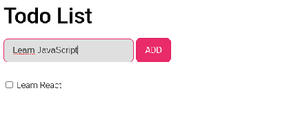
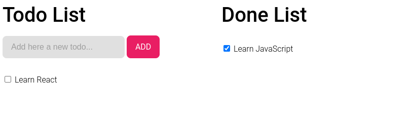

# Todo App

Implementare una _"Todo List"_ che visualizzi la lista di cose da fare nel modo seguente:

### Parte 1

- [ ] Implementare un componente React che rispetti quello nella figura sopra (anche in questo caso lo stile non ha importanza).
- [ ] Implementare un listener sul pulsante "ADD" che effettua le seguenti operazioni:
  - [ ] Prenda la stringa in input e la trasformi in una "cosa da fare". Una cosa da fare è un oggetto JavaScript che ha le seguenti caratteristiche:
    - [ ] id: L'identificativo univoco della cosa da fare.
    - [ ] description: La descrizione della cosa da fare (es "Learn JavaScript")
    - [ ] done: Un valore booleano che ci fa capire se quella determinata cosa è stata fatta o meno
  - [ ] Una volta creato l'oggetto deve inserirlo nella _"Lista"_ delle cose da fare
  - [ ] Nel caso in cui l'input text è vuoto mostrare un messaggio di errore
  - [ ] Aggiorni la lista in visualizzazione
  - [ ] Svuota l'input di testo sopra
- [ ] Implementare un listener sulla lista di cose da fare in modo che questa venga rimossa dalla lista. Di conseguenza aggiorni la lista delle cose da fare in visualizzazione.

### Parte 2

- [ ] Affiancare alla lista delle cose da fare, la lista delle cose fatte. In modo da rispettare il seguente template:

- [ ] Ogni volta che una cosa da fare viene rimossa dalla lista delle cose fatte viene inserita in quella delle già fatte.
- [ ] Quando viene cliccata la checkbox di una cosa già fatta questa viene spostata nuovamente nella lista delle cose da fare.

### Regole

- Utilizzate il Design System implementato nella lezione precedente :smile: